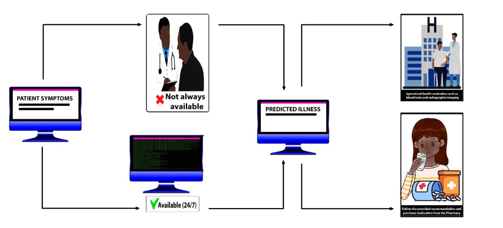

# Title: Modelling and Disease Prediction from Different Symptoms Using Machine Learning.

## Abstract

Early and accurate analysis and treatment of infectious disease is relevant
for disease prevention in human and animal populations. In cases of serious infections,
the traditional method of diagnosis might not help. In most instances, the medical doctor
might not be available to attend to the patient. Developing a medical diagnosis system
based on machine learning (ML) algorithms for the prediction of any disease can help in
a more accurate diagnosis than the conventional method. This project seeks to propose
and develop a disease prediction system using multiple machine learning (ML)
algorithms. These machine-learning algorithms will predict the disease based on age,
gender, and symptoms.

<<<<<<< HEAD

=======
>>>>>>> bda760e0db2c87b8f09bd1426c12e4baceab4ca1

## Implementation

This project focuses on predicting diseases based on symptoms through various machine learning algorithms, including Decision Tree, Random Forest, Weighted K-Nearest Neighbors, Naïve Bayes, Support Vector Classifier (SVC), and Ensemble Learning methods such as XGBoost, AdaBoost, CatBoost, LightGBM Classifier, and Extra Trees Classifier. Additionally, it employs Neural Networks like Multi-Layer Perceptron (MLP), Long Short-Term Memory (LSTM), and Gated Recurrent Unit (GRU). The dataset utilized in this project is an open-source collection from the Kaggle Data Repository, encompassing data from 4,962 patients with 42 distinct diseases.

## Dataset

The dataset consists of information on 4,962 patients across 42 different diseases, including:

- Fungal Infection
- Allergy
- Gastroesophageal Reflux Disease (GERD)
- Chronic Cholestasis
- Drug Reaction
- Peptic Ulcer Disease
- AIDS
- Diabetes
- Gastroenteritis
- Bronchial Asthma
- Hypertension
- Migraine
- Cervical Spondylosis
- Paralysis (Brain Hemorrhage)
- Jaundice
- Malaria
- Chicken Pox
- Dengue
- Typhoid
- Hepatitis A
- Hepatitis B
- Hepatitis C
- Hepatitis D
- Hepatitis E
- Alcoholic Hepatitis
- Tuberculosis
- Common Cold
- Pneumonia
- Dimorphic Hemorrhoids (Piles)
- Heart Attack
- Varicose Veins
- Hypothyroidism
- Hyperthyroidism
- Hypoglycemia
- Osteoarthritis
- Arthritis
- Paroxysmal Positional Vertigo
- Acne
- Urinary Tract Infection
- Psoriasis
- Impetigo

## Architecture

The following machine learning algorithms are employed for disease prediction based on symptoms:

- **Decision Tree**
- **Random Forest**
- **XGBoost**
- **AdaBoost**
- **CatBoost**
- **LightGBM Classifier**
- **Gradient Boosting**
- **Extra Trees Classifier**
- **Weighted K-Nearest Neighbor**
- **Naïve Bayes**
- **Support Vector Machine**

Neural Network models used include:

- **Multi-Layer Perceptron (MLP)**
- **Long Short-Term Memory (LSTM)**
- **Gated Recurrent Unit (GRU)**

## Project Workflow

The project follows this workflow:

1. **Data Collection**: The dataset is sourced from the Kaggle Data Repository.
2. **Data Preprocessing**: The dataset is cleaned, and missing values are addressed.
3. **Data Visualization**: Visualization techniques are applied to gain insights and a better understanding of the data.
4. **Feature Selection**: Significant features are selected for model training.
5. **Model Building**: Eleven different machine learning algorithms are implemented  and Three Neural network to train the models.
6. **Model Evaluation**: The model's performance is assessed using various metrics.
7. **Interactive Interface**: An interactive interface is developed to enhance user interaction with the data.

## Results

The model's performance is measured using several metrics, including accuracy, precision, recall, and F1-score. The results indicate that the Weighted K-Nearest Neighbor algorithm achieves the highest accuracy, at **99.7%**.

## Conclusion

Employing machine learning algorithms for disease prediction based on symptoms shows great promise as a cost-effective and efficient diagnostic approach. This project's findings highlight the effectiveness of these algorithms in predicting diseases from symptoms. Furthermore, an interactive interface can assist healthcare professionals in making informed decisions and delivering accurate diagnoses.
